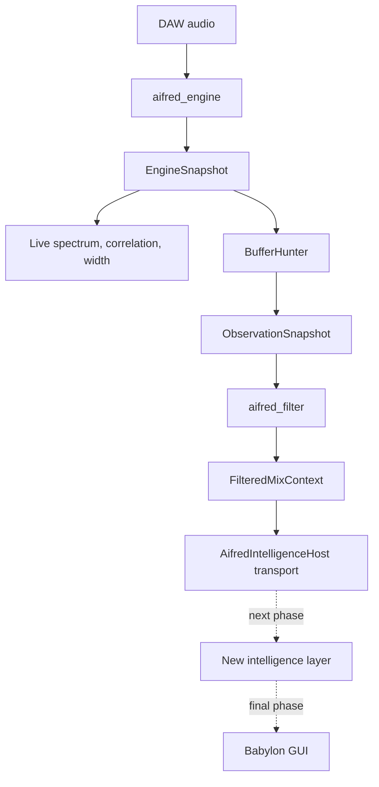

# Current architecture

## Active pipeline

The solid path exists. The dotted intelligence and Babylon nodes do not.

## Ownership

| Responsibility | Owner | Implementation |
|---|---|---|
| Authoritative measurements | `aifred_engine` | [Engine](../shared-dsp/src/Engine.cpp), [Spectrum](../shared-dsp/src/Spectrum.cpp), [Loudness](../shared-dsp/src/Loudness.cpp), [True Peak](../shared-dsp/include/aifred/TruePeak.h) |
| Realtime publication | `EngineSnapshot` and bounded SPSC queue | [Contracts](../shared-dsp/include/aifred/Contracts.h), [Engine](../shared-dsp/include/aifred/Engine.h) |
| Temporal observation | `BufferHunter` | [contract](../shared-dsp/include/aifred/BufferHunter.h), [implementation](../shared-dsp/src/BufferHunter.cpp) |
| Deterministic semantic/reference state | `aifred_filter` | [contract](../shared-dsp/include/aifred/Filter.h), [implementation](../shared-dsp/src/Filter.cpp) |
| Processor adapter and timer consumer | `Pipeline` | [contract](../shared-dsp/include/aifred/Pipeline.h), [implementation](../shared-dsp/src/Pipeline.cpp) |
| Plugin audio/state adapter | `PluginProcessor` | [header](../plugin/src/PluginProcessor.h), [implementation](../plugin/src/PluginProcessor.cpp) |
| Current frontend projection | `ViewSnapshot` | [projection](../plugin/src/ViewSnapshot.h) |
| Provider transport | `AifredIntelligenceHost` | [host](../tools/AifredIntelligenceHost/Program.cs), [client](../shared-dsp/src/IntelligenceClient.cpp) |

One implementation location owns each responsibility. No Python runtime, raw `AnalysisSnapshot` model path, duplicate analyzer, analyzer fallback, or `.NET AifredEngine` participates.

## Realtime boundary

`PluginProcessor::processBlock` validates pointers, counts, and finite input, then calls `Pipeline::process`. The engine performs bounded DSP and attempts one SPSC publication at each 100 ms cadence. It does not allocate, lock, log, perform I/O, query references, or serialize JSON in the audio callback. The 20 ms pipeline timer drains at most seven queued snapshots and owns BufferHunter consumption.

Audio passes through unchanged. Analysis-only profile and presentation settings cannot insert processing into the DAW signal path.

## Identity and lifetime

Every `EngineSnapshot`, `ObservationSnapshot`, and `FilteredMixContext` carries the stable profile ID and profile revision. Context also carries a stable measurement configuration identity such as `SPECTRUM_SURGICAL.r1`. Profile, revision, sample-rate/channel, manual reset, incompatible publication gap, and major transport discontinuity start new epochs. Editor close/reopen does not.

The processor owns both the pipeline and observation lifetime. `AifredIntelligenceHost` remains a transport host on channel `official`, port `8788`; it validates identity and does not reinterpret measurements.

## Frontend ownership

Live spectrum, correlation, and width use `EngineSnapshot`. Other engineering meters use unrounded `ObservationSnapshot` values. GUI targets remain continuous float32. Text and model publication apply their own formatting after measurement and observation.

`ViewSnapshot::metricDetails` supplies metric ID, display name, unit, validity, raw current value, observed distribution, trend, source ownership, active profile/revision, and emphasized profile. That contract prepares future meter-detail views without adding DSP.

## Related

- [DSP Configuration](DSP_CONFIGURATION.md)
- [Shared DSP](../shared-dsp/README.md)
- [BufferHunter](BUFFER_HUNTER.md)
- [AIFRED Filter](AIFRED_FILTER.md)
- [Testing](TESTING.md)
- [Future](FUTURE.md)
