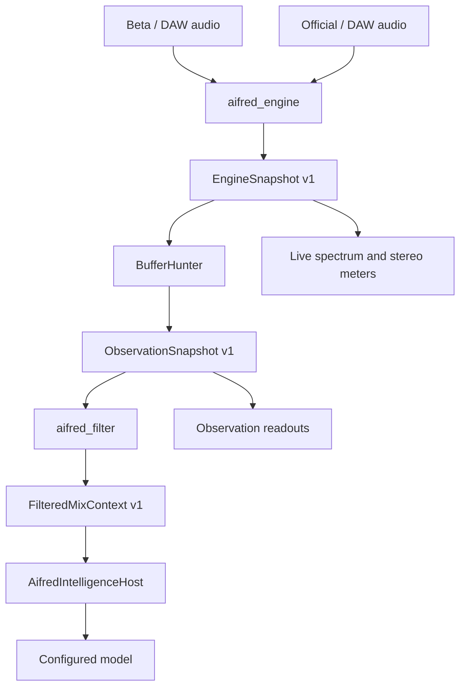

# Shared core 1.1.0

Both products vendor identical shared-dsp and Intelligence Host source. shared-core.lock.json pins a normalized SHA-256 inventory. Canonical tests/releases verify it. `python -B scripts/common/check_shared_core.py --peer <other-clone>` additionally compares explicit clones. Standalone builds have no sibling dependency or new remote. Review/version both copies together.

Shared source does not mean shared mutable analysis. Each processor owns DSP, publication, observation, client and conversation. Beta Compare owns a separate input pipeline.

## Measurement definitions

- Sample peak: maximum absolute channel sample over the RMS window; 20 log10 conversion. Unrounded magnitude >=1 drives sample-over detection; cumulative count resets with epoch.
- RMS: mean channel energy over a rectangular 400 ms window; full-scale sine is -3.0103 dBFS. Broadband crest is sample peak minus RMS over that same window.
- True peak: reconstructed programme maximum, 64-tap Blackman-windowed sinc phase interpolation, 4x below 96 kHz, 2x below 192 kHz, 1x at 192 kHz; 32-sample delay. This uses the oversampled-reconstruction approach of BS.1770 Annex 2, without certification. Finite-filter, start/end and high-rate under-read limits remain to be validated. No linear interpolation/calibration offset.
- Loudness: BS.1770 K-weighting shelf/RLB, channel energy summation; 400 ms momentary and 3 s short-term. Integrated: 400 ms blocks every 100 ms, -70 LUFS absolute then -10 LU relative gates, programme energy accumulation. LRA: 3 s values at 10 Hz, -70 LUFS/-20 LU gates, P95-P10. Bounded 0.01 LU histograms retain full-precision power sums; gating/percentile discretization is limited by that resolution. Programme measures remain independent of BufferHunter. Short-programme LRA is provisional; no full EBU Mode certification.
- Stereo: sum(LR)/sqrt(sum(LL)sum(RR)), unavailable with silent denominators. Channel energies and R/L dB balance use the stereo window. Mid=(L+R)/2; Side=(L-R)/2. Width=100*SideEnergy/(MidEnergy+SideEnergy), a documented presentation scale, not an industry standard. Vectorscope pairs are bounded sampled L/R data.
- Spectrum: radix-2 real-input STFT, periodic Hann, 75% overlap. Separate channel powers are averaged; one-sided normalization N*sum(window squared), doubled interior bins, obeys Parseval. Exponential power averaging and separate peak hold/release. Hero retains 1025/4097 bins. Only rendering clips to -24..0 dB.
- Telemetry: geometric-midpoint regions around 30 AIFRED centres, including 850 Hz at index 16. Fractional FFT-bin-cell overlap accumulates power before dB conversion. Regions beyond Nyquist are unavailable. These are AIFRED centres, not a metering standard or replacement FFT.

Mono/stereo input supports finite 32–192 kHz rates divisible by 10, including normal 44.1/48/88.2/96/176.4/192 kHz. Unsupported configuration is unavailable; nonfinite samples reset measurement without changing pass-through audio.

## Profiles

| ID | Revision | FFT | RMS / stereo | Average / release / hold | Observation |
|---|---:|---:|---|---|---|
| MIX_BALANCED | 1 | 2048 | 400 / 400 ms | 0.4 / 0.5 / 2 s | 15 s |
| SPECTRUM_SURGICAL | 1 | 8192 | 400 / 400 ms | 2 / 1.5 / 4 s | 20 s |
| MASTERING_PRECISION | 1 | 8192 | 400 / 400 ms | 3 / 2 / 5 s | 25 s |
| STEREO_PHASE_DIAGNOSTIC | 2 | 2048 | 400 / 100 ms | 0.4 / 0.5 / 2 s | 15 s |

All configure one algorithm library. Snapshots publish at 10 Hz; consumer service is 20 ms. Diagnostic phase reversal resolves within 100 ms. GUI positions are continuous float32 with short interpolation. Correlation/width use live DSP; other engineering meters use unrounded observations. Text/model precision is separate: whole dBFS/LUFS/dB/percent summaries, 0.1 dBTP, approximately 0.01 correlation. DSP/observations retain double precision.

## Lifetime and context

Audio performs bounded DSP and one SPSC push. Eight slots provide seven usable snapshots. Full queues drop publication and count it; no retry, lock, I/O, JSON, reference lookup or aggregation occurs in audio. Consumer drains at most seven; missing coverage closes the observation epoch. UI locks are outside realtime.

BufferHunter stores at most 300 frames and publishes median, P10/P90, extrema, coverage/count and conservative regression trend. Integrated/LRA/true peak keep latest programme values. Silence retains useful observation with inactive signal; freshness expires one second after active input/stalled publication. Stop/resume retains accumulation. Seek/loop jumps >1 s reset programme. Profile/revision, rate/channel, manual reset and incompatible gaps create new epochs. Editor lifetime has no effect.

Filter preserves explicit metric/unit/frequency/validity/freshness/duration. References require matching schema, profile/revision and sample rate; missing/incompatible data stays unavailable. There is no universal spectral/music-loudness target, quality score, frequency-specific broadband crest conclusion or measured mastered boolean. Standard relationships remain unavailable without an implemented delivery policy.

Only aifred.filtered-mix.v1 reaches the model, with channel/version, instance/session IDs and profile. Four previous observation/question/response records are bounded per processor; stated actions are unverified DAW actions. Host validates/routes Ollama or OpenAI-compatible transport and echoes identity; it never reinterprets DSP.

Future, unexposed: TRACKING_FAST, REFERENCE_LONG_TERM, LOUDNESS_COMPLIANCE, K-System, SOUL.md/HEARTBEAT.md/SKILLS.md/MEMORIES.md, FORGE-style audio tools, topology/inventory/web tools and long-term memory.

Sources: [ITU-R BS.1770](https://www.itu.int/rec/R-REC-BS.1770), [EBU Tech 3341](https://tech.ebu.ch/docs/tech/tech3341.pdf), [EBU Tech 3342](https://tech.ebu.ch/docs/tech/tech3342.pdf). [Testing](../docs/TESTING.md) records validation limits.
